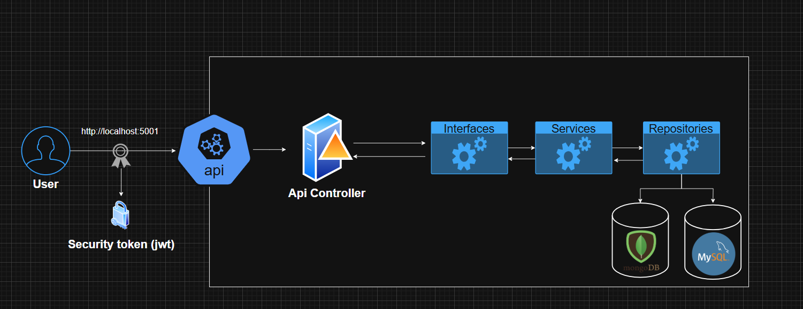

## Users.Api
It is an API designed to manage user accounts, generate tokens, and perform related operations. It is built to connect to multiple databases, including MongoDB and MySQL, to provide flexible storage options and seamless integration across different data sources. The API serves as a core component for user management in your application infrastructure.

## 📄 API Reference
### Diagram


### 🔐Authorization
It implements JWT authentication to secure endpoints, validating issuer, audience, and signature, allowing access only to authorized users.
```
[Authorize(AuthenticationSchemes = "Auth0App1")]
[Authorize(AuthenticationSchemes = "Auth0App2")]
```
Environment variables setting (auth0 in this case)
```
  "Auth0App1": {
    "Issuer": "https://test.asdasdasd.auth0/",
    "Audience": "Test-Api"
  },
  "Auth0App2": {
    "Issuer": "AgusFassina",
    "Audience": "Agusfassina"
  }
```

### 🚀Dotnet build and run
```
dotnet build
dotnet run
```

### 🚀Docker build and run

```
# Docker build
docker build -f Dockerfile -t api .
# Docker run in the port 8787
docker run -d -p 8787:80 -e "ASPNETCORE_ENVIRONMENT=Development" --name api api
# api tests http://localhost:8787/swagger/index.html
```


